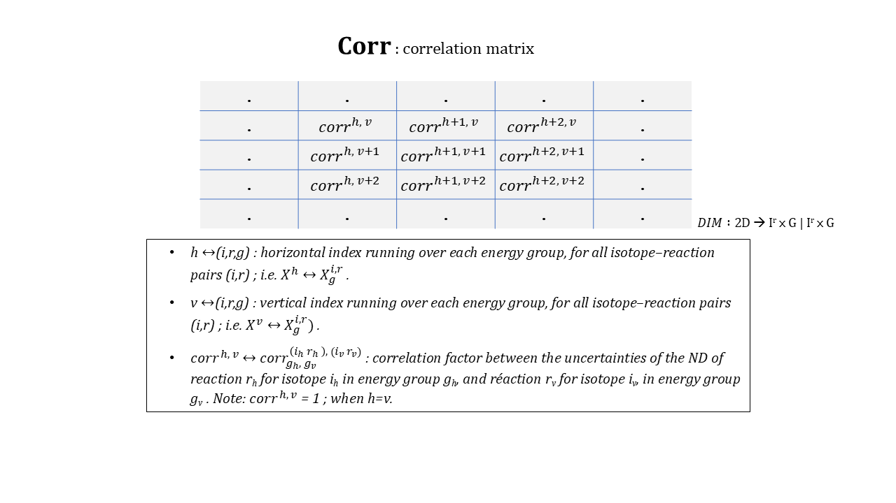
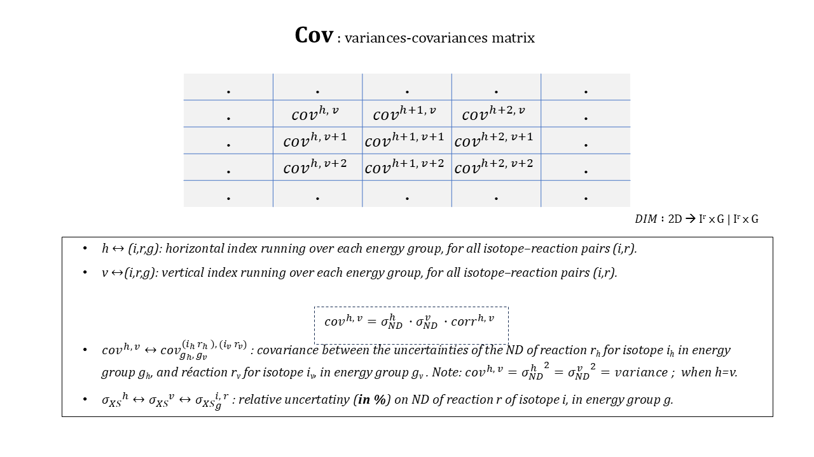
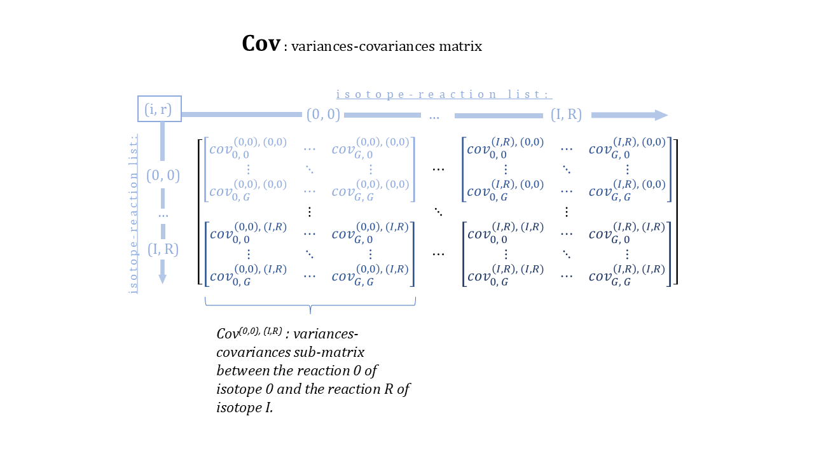

# CALINS

### **CAL**culations and **I**nvestigations on **N**uclear data uncertainties and **S**ensitivities

[](https://www.python.org/downloads/)
[](LICENSE)

> A Python package for computing nuclear data uncertainty propagation, sensitivity analyses, and data assimilation using the Generalized Linear Least Squares Method (GLLSM).

**📚 [Read the Documentation](https://asnr-fr.github.io/CALINS/)** | **🚀 [Quick Start Guide](https://asnr-fr.github.io/CALINS/installation/)** | **💡 [Usage Examples](https://asnr-fr.github.io/CALINS/usage-examples/creating-case-object/)**

**Developed by**: French Authority for Nuclear Safety and Radiation Protection (ASNR)

---

## Table of Contents

- [**About**](#about)
- [**Features**](#features)
- [**Quick Start**](#quick-start)
- [**Installation**](#installation)
  - [Prerequisites](#prerequisites)
  - [Installing CALINS](#installing-calins)
  - [Verification](#verification)
- [**Usage Examples**](#usage-examples)
  - [Creating a Case Object](#creating-a-case-object)
  - [Calculating Uncertainty](#calculating-uncertainty)
  - [Computing Similarity Indices](#computing-similarity-indices)
  - [Performing Data Assimilation](#performing-data-assimilation)
  - [Sensitivity Analysis and Case Screening](#sensitivity-analysis-and-case-screening)
- [**Points of Attention**](#points-of-attention)
- [**Theory**](#theory)
  - [Introduction](#introduction)
  - [Sensitivity Vector](#sensitivity-vector)
  - [Covariance Matrix](#covariance-matrix)
  - [Alignment Rule for Matrix Calculations](#alignment-rule-for-matrix-calculations)
  - [Uncertainty Calculation on the Response: σrespND](#uncertainty-calculation-on-the-response-σrespnd)
  - [Assimilation of Experimental Data and Bias Calculation via GLLSM](#assimilation-of-experimental-data-and-bias-calculation-via-gllsm)
    - [Pre-sorting of Benchmark Cases to Assimilate](#pre-sorting-of-benchmark-cases-to-assimilate)
    - [Assimilation Formulas](#assimilation-formulas)
  - [Reflections on Experimental Correlations](#reflections-on-experimental-correlations)
- [**Developer Manual**](#developer-manual)
  - [methods.py](#methodspy)
    - [Acquisition and Formatting of Useful Data (Pandas Dataframe)](#acquisition-and-formatting-of-useful-data-pandas-dataframe)
    - [Construction of Matrices and Vectors (Numpy Arrays)](#construction-of-matrices-and-vectors-numpy-arrays)
    - [Calculation Functions](#calculation-functions)
    - [Utility Functions](#utility-functions)
  - [classes.py](#classespy)
    - [Case](#case)
    - [Uncertainty](#uncertainty)
    - [Bias](#bias)
    - [Assimilation](#assimilation)
  - [plots.py](#plotspy)
  - [errors.py](#errorspy)
  - [logs.py](#logspy)
- [**Contributing**](#contributing)
- [**Troubleshooting**](#troubleshooting)
- [**Citation**](#citation)
- [**References**](#references)
- [**License**](#license)

---

## About

CALINS is a specialized Python package designed for nuclear safety and criticality calculations. It enables:
- **Uncertainty propagation** from nuclear data to integral responses
- **Sensitivity analysis** of nuclear systems to cross-section variations
- **Data assimilation** using the Generalized Linear Least Squares Method (GLLSM)
- **Bias estimation** for calculated responses based on experimental benchmarks

The package is particularly useful for criticality safety analyses where understanding uncertainties and biases in calculated k<sub>eff</sub> values is essential.

## Features

- ✅ **Uncertainty Calculation**: Propagate nuclear data uncertainties using the sandwich formula
- ✅ **Sensitivity Analysis**: Process and visualize sensitivity profiles from SDF files
- ✅ **Similarity Indices**: Calculate E, C<sub>k</sub>, G, and SSR indices between cases
- ✅ **GLLSM Assimilation**: Assimilate experimental benchmark data to reduce uncertainties
- ✅ **Multiple Covariance Formats**: Support for SCALE (COVERX binary/text), COMAC, GENDF, and Excel (xlsx) formats, with auto-detection
- ✅ **Interactive Visualizations**: Generate HTML reports with Plotly graphs
- ✅ **Chi-squared Filtering**: Automatic filtering of inconsistent benchmark cases

# Installation

## Prerequisites

- **Python**: Version 3.9 or higher
- **Operating System**: Windows, macOS, or Linux
- **Dependencies**: Listed in `requirements.txt` (automatically installed)
  - numpy ≥ 1.24.2
  - pandas ≥ 2.0.0
  - plotly ≥ 5.14.0
  - matplotlib ≥ 3.8.3
  - tabulate ≥ 0.9.0
  - scipy ≥ 1.13.0

## Installing CALINS

### Method 1: From GitHub (Latest Version)

1. **Clone or download the repository**:
   ```bash
   git clone https://github.com/ASNR-fr/CALINS.git
   cd CALINS
   ```

2. **Install the package**:
   ```bash
   pip install .
   ```

### Method 2: From ZIP Archive

If you have downloaded a compressed archive:

```bash
pip install calins-archive.zip
```

### Method 3: Development Installation

For development or contributing, install in editable mode:

```bash
pip install -e .
```

## Verification

Verify that CALINS is installed correctly:

```python
import calins as cl
print(cl.__name__)  # Should print: calins
```

You can also check for auto-completion in your Python IDE/environment to confirm the installation.

# Usage Examples

This section provides practical examples for common CALINS operations. For comprehensive examples, refer to the `USER_EXAMPLES.ipynb` notebook.

## Creating a Case Object

A `Case` object represents a study case or benchmark with sensitivity data:

```python
import calins as cl

# Path to your sensitivity file (.sdf format)
sensi_file_path = 'path/to/sensitivity.sdf'

# Create Case object
# occurrences_rule: how to handle multiple occurrences of same iso-reac pair
#   Options: "first", "last", "sum" (default)
my_case = cl.Case(sdf_path=sensi_file_path, occurrences_rule="sum")

# Generate HTML visualization of sensitivities
my_case.export_to_html(
    output_html_path='case_sensitivities.html',
    plotting_unit='pcm'  # Options: 'pcm' or 'relative'
)

# Access case attributes
print(f"Case name: {my_case.casename}")
print(f"Energy groups: {my_case.group_nb}")
print(f"Calculated k_eff: {my_case.resp_calc} ± {my_case.sigma_resp_calc}")
if my_case.resp_expe:
    print(f"Experimental k_eff: {my_case.resp_expe} ± {my_case.sigma_resp_expe}")
```

## Calculating Uncertainty

Calculate nuclear data uncertainty using the sandwich formula:

```python
import calins as cl

# Load covariance data using NDCovariances object (recommended)
scale_file_path = 'path/to/scale_44g'
cov_data = cl.NDCovariances(input_path=scale_file_path, format='coverx')
# Alternative formats: 'coverx_text', 'comac', 'gendf', 'xlsx', or 'auto' for auto-detection

# Load sensitivity data
sensi_file_path = 'path/to/sensitivity.sdf'

# Calculate a priori uncertainty
uncertainty = cl.calcul_uncertainty(
    study_case=sensi_file_path,  # Can also be a Case object
    cov_data=cov_data,
    output_html_path='uncertainty_report.html'
)

print(f"A priori uncertainty: {uncertainty.value} pcm")
print(f"Calculated k_eff: {uncertainty.resp_calc}")

# Export decomposition to Excel
uncertainty.decomposition.to_excel('uncertainty_decomposition.xlsx')

# Optional: Export and re-import covariance data via Excel
# cov_data.write_xlsx('covariance_data.xlsx')
# cov_data_reloaded = cl.NDCovariances(input_path='covariance_data.xlsx', format='xlsx')
```

## Computing Similarity Indices

Evaluate similarity between different cases:

```python
import calins as cl

# Load two cases to compare
case1 = cl.Case('path/to/case1.sdf')
case2 = cl.Case('path/to/case2.sdf')

# Load covariance data using NDCovariances object (recommended)
cov_data = cl.NDCovariances(input_path='path/to/covariance', format='auto')

# Calculate E similarity index (0 to 1)
E_index = cl.calcul_E(case1, case2)
print(f"E similarity index: {E_index}")

# Calculate C_k index (weighted by covariances)
Ck_index = cl.calcul_Ck(case1, case2, cov_data)
print(f"C_k similarity index: {Ck_index}")

# Calculate SSR index (Shared Sensitivity Ratio)
SSR_index = cl.calcul_SSR(study_case=case1, bench_case=case2, reference=case1)
print(f"SSR index: {SSR_index}")
```

## Performing Data Assimilation

Assimilate experimental benchmark data using GLLSM:

```python
import calins as cl

# Define study case
study_case = cl.Case('path/to/study_case.sdf')

# Define benchmark cases
benchmarks = [
    cl.Case('path/to/benchmark1.sdf'),
    cl.Case('path/to/benchmark2.sdf'),
    cl.Case('path/to/benchmark3.sdf')
]

# Load covariance data using NDCovariances object (recommended)
cov_data = cl.NDCovariances(input_path='path/to/covariance', format='auto')

# Perform assimilation
assimilation = cl.Assimilation(
    study_case=study_case,
    benchmarks_list=benchmarks,
    cov_data=cov_data,
    chi2_threshold=1.5,  # Optional: chi-squared filtering threshold
    Ck_threshold=0.7,    # Optional: C_k similarity threshold
    output_html_path='assimilation_results.html'
)

# Access results
print(f"Prior uncertainty: {assimilation.prior_uncertainty.value} pcm")
print(f"Posterior uncertainty: {assimilation.post_uncertainty.value} pcm")
print(f"Bias: {assimilation.bias.value} pcm")
print(f"Chi-squared: {assimilation.chi2_initial} → {assimilation.chi2_final}")
```

## Sensitivity Analysis and Case Screening

CALINS provides advanced capabilities for sensitivity analysis and case screening, allowing users to identify the most sensitive cases and analyze sensitivity patterns across multiple benchmarks.

These functions are particularly useful for:
- **Benchmark selection**: Identifying the most sensitives cases, targetting specific nuclear data
- **Pattern identification**: Spotting systematic sensitivity trends across benchmark suites and uderstanding which energy ranges drive uncertainties
- **Isotope comparison**: Comparing sensitivity patterns between different isotopes
- **Benchmark characterization**: Understanding the physical characteristics of different experiments
- **Cross-section priority**: Determining which nuclear data require the most attention

### Finding Sensitive Cases

Use `find_sensitive_cases()` to identify cases with significant sensitivities to specific isotope-reaction pairs:

```python
import calins as cl
import pickle

# Path to a pickle containing a dictionary of Case objects
pickle_db = "/PATH/TO/DATABASE/cases.pickle" 

with open(pickle_db, "rb") as pickle_file:
    dict_pickle = pickle.load(pickle_file)

# Selecting cases to consider for analysis - here all MIX-COMP-THERM except series 006
filtered_cases = cl.filter_cases(dict_pickle, to_keep=["MIX-COMP-THERM"], to_exclude=["MIX-COMP-THERM-006"]) 

# Searching for cases sensitive to the fission cross-sections of U-235 and Pu-239 in the thermal domain,
# based on integral sensitivities, not normalized in lethargy.
# Only bins with a sensitivity ≥ 2e-3, representing more than 10% of the integral sensitivity, are considered sensitive.
sensitive_cases = cl.find_sensitive_cases(
    dict_pickle,
    filtered_cases,
    isotopes=[92235, 94239],
    reactions=[18, 18],
    energy_regions=["thermal", "thermal"],
    sensitivity_threshold=2e-3,
    fraction_threshold = 0.10,
    integrate_data=True,
    normalize_lethargy = False,
)

# Displaying in the terminal the 50 most sensitive cases according to the previous search criteria
cl.display_most_sensitive_cases(dict_sensitive = sensitive_cases, max_number_of_cases_displayed=50)
```

### Creating Sensitivity Heatmaps

Use `plot_sensitivity_heatmap()` to create visual heatmaps showing how many cases show the same sensitivity patterns across multiple energy regions:


```python
import calins as cl
import pickle

# Path to a pickle containing a dictionary of Case objects
pickle_path = "/PATH/TO/DATABASE/database_dict.pickle"

with open(pickle_path, "rb") as pickle_file:
    dict_pickle = pickle.load(pickle_file)

# Selecting cases to consider for analysis - here all LEU-COMP-THERM except series 001
list_cases = cl.filter_cases(dict_pickle, to_keep=[], to_exclude=[]) 

# Creating a heatmap of cases sensitive to cross-sections of SCATTER (0), TOTAL (1), ELASTIC (2), N,GAMMA (102)
# Only bins with a sensitivity ≥ 2e-3 and representing more than 10% of the integral sensitivity will be considered sensitive.
cl.plot_sensitivity_heatmap(
    dict_data=dict_pickle,
    cases=list_cases,
    isotopes=[17035, 17037],
    reactions=[0, 1, 2, 102],
    sensitivity_threshold=2e-3,
    fraction_threshold = 0.10,
    user_energy_bins=None,
    title="Cases pickle db sensitivity heatmap for chlorine isotopes",
    namefig=None,
    save_logfile=True,
)
```

## Points of Attention

⚠️ **Important Considerations** (read this section along with the [Theory](#theory) chapter and examples in `USER_EXAMPLES.ipynb`)

### Special Isotope Handling

- **Bounded isotopes**: Some isotopes in sensitivity files are not present in variance-covariance matrices. TSURFER (SCALE) uses data from the closest isotope, and CALINS detects these cases when the hundreds digit of the ID is ≥ 3:
  - `be-9 bounded` (ID=4309 or 4509) → associated with covariances of `be-9` (ID=4009)
  - `h-1 bounded` (ID=1901 or 1801) → associated with covariances of `h-1` (ID=1001)

- **Natural isotopes**: Isotopes with 'natural' evaluated forms:
  - `c-12 bounded` (ID=6312) → associated with covariances of `c-0` (ID=6000)

### Reaction ID Considerations

- **CAPTURE vs N,GAMMA**: Some covariance matrices have data for CAPTURE reaction (ID=101), others for N,GAMMA reaction (ID=102), which are very close. Be careful when associating these reactions.

- **MCNP negative IDs**: SDF files from MCNP calculations can contain reactions with negative IDs:
  - CALINS associates reaction `-2` to reaction `101` if the `mcnp=True` flag is enabled when creating the Case object
  - Other negative reactions trigger a warning

### Sensitivity Profile Occurrences

When an SDF file has multiple sensitivity profiles for the same isotope-reaction pair (same IDs), TSURFER (SCALE) parses profiles differently. CALINS provides three rules:
- `occurrences_rule='first'`: Use the first occurrence as the sensitivity profile
- `occurrences_rule='sum'` (default): Sum all occurrences for the profile
- `occurrences_rule='last'`: Use the last occurrence


# Theory

⚠️ The term *response* (or *resp*) is used here to denote the integral response (experimental or calculated). ⚠️

## **Introduction**
When a response value is calculated, e.g., a k<sub>eff</sub>, there is a calculation bias Δresp between the simulated model's response value and the experimental observed value. This bias is primarily composed of bias due to nuclear data Δ<sub>resp</sub><sup>ND</sup> and bias due to approximations in calculation schemes Δ<sub>resp</sub><sup>SC</sup>. The methods described here allow estimating the calculation bias and its associated uncertainty.
The estimation method Δ<sub>resp</sub> used is the GLLSM (Generalized Linear Least Squares Method). It assumes that Δ<sub>resp</sub><sup>ND</sup> dominates the total bias (valid e.g. for Monte Carlo). It also assumes that the response variation due to small nuclear data changes is linear.  

The uncertainty σ<sub>resp</sub><sup>ND</sup> due to nuclear data is computed using the propagation matrix product formula (i.e. “sandwich formula”), which propagates sensitivities (of the response to ND) through a variances-covariances of ND matrix.

Note: here "nuclear data" refers to microscopic cross-section data, as an example. Other data such as angular distributions could be included.
All formulas are valid for data expressed in relative values.

## **Sensitivity vector**
The sensitivity vector, for a given model, is composed of sub-vectors corresponding to sensitivities of resp<sup>calc</sup> to multigroup cross sections for a given isotope-reaction pair.  
The isotope-reaction pairs form the “isotope-reaction list,” whose order must be consistent for all matrix operations.


The isotope-reaction pairs linked to the sub-vectors forms a list called the "isotope-reaction list". This list and its order are important to respect the alignment rule between vectors and matrices.

## **Covariance matrix**
The covariance matrix (Cov) is constructed from multi-group uncertainties on cross sections and their correlations (Corr). It is symmetric by construction.  


The covariance matrix can also be interpreted as a composition of covariances sub-matrices, for each pair of isotope-reaction couples, aligned horizontally and vertically: (i<sub>h</sub>, r<sub>h</sub>)-(i<sub>v</sub>, r<sub>v</sub>).


## **Alignment rule for matrix calculations**
Matrix multiplications are only valid if terms align: isotope-reaction pairs and energy groups must correspond.  
This is ensured by using identical isotope-reaction lists and energy group ordering across vectors/matrices.

## **Uncertainty calculation on the response: σ<sub>resp</sub><sup>ND</sup>**
The sandwich formula allows the propagation of response sensitivities to nuclear data through the covariances matrix, to evaluate the global uncertainty on response due to nuclear data σ<sub>resp</sub><sup>ND</sup>(in relative value).

**Sandwich Formula:**

$$ {σ_{resp}}^{ND} = \sqrt{S \space · \space Cov \space · \space S^t} $$

$S$: sensitivity vector &nbsp;&nbsp;&nbsp;&nbsp;&nbsp;&nbsp;&nbsp;&nbsp;&nbsp;$Cov$: covariance matrix
## **Assimilation of experimental data and bias calculation via GLLSM**
The GLLSM method consists in assimilating experiences (also called "benchmark" cases) whose response has been measured and calculated.

---
*The GLLS approach considers potential variations in data parameters and measured integral responses that minimize the differences in measured and calculated integral responses (such as keff) for a set of benchmark experiments, taking into account uncertainties and correlations in the ENDF data and in the integral measurements. Since there are generally many more cross-section values than measured integral responses, the determination of the data modifications is an under-determined problem. If the data variations are not performed in a reasonable manner, non-physical changes may be obtained. Data adjustments in the GLLS methodology are constrained by the magnitude of the nuclear data uncertainties and their correlations. TSURFER also accounts for uncertainties and correlations in the integral response measurements, arising from experimental uncertainties in parameters such as enrichment, density, impurities, etc. As long as realistic data covariances are used, the resulting data adjustments may be considered the “best estimates”-within the limitations of the GLLS linearity approximation-for realistic data alterations that improve the computed integral responses. It can be shown that the GLLS equations provide the maximum likelihood estimator for the correct nuclear data if the evaluated nuclear data and system parameters obey a multivariate normal probability distribution* [^1].
[^1]: R. N. Hwang. Topics in data adjustment theory and applications. In Proceedings of the Specialists' Meeting on the Application of Critical Experiments and Operating Data to Core Design via Formal Methods of Cross Section Data Adjustment. Jackson Hole, WY (USA), 9 1988.

---
This assimilation method yields:
1. **Global nuclear data variation vector** ($\Delta\mu_{XS}$): Derived from assimilated benchmarks, enabling posterior bias prediction Δresp<sup>post</sup> for a study case whose response is not known experimentally (vector $S_{cas}$)
2. **Adjusted covariance matrix** ($Cov'$): Enabling posterior uncertainty calculation σ<sub>resp</sub><sup>ND post</sup> for a study case ($S_{cas}$) using the sandwich formula

The validity domain of this method is defined by several hypotheses:
- The total calculation bias is mostly composed of Δ<sub>resp</sub><sup>ND</sup> (verified especially for pointwise Monte Carlo calculations)
- The response variation caused by small variations in nuclear data is reasonably linear
- The study case is similar in sensitivity to the assimilated benchmarks (similarity is discussed below)

### **Pre-sorting of benchmark cases to assimilate**
The impact of benchmarks on posterior uncertainty σ<sub>resp</sub><sup>ND post</sup> depends on similarity to the study case (fissile material, moderator, spectrum).
It is possible to pre-sort experiments to assimilate based on these physical criteria. For example, ICSBEP classifications already help pre-select benchmark cases similar to you study case.

Similarity indicators (E, Ck, G, SSR, etc.) can also be computed between sensitivity vectors. They help pre-sort benchmarks, which, once assimilated, will best impact the posterior uncertainty of the study case.

These indicators should be calculated for each benchmark to add to the assimilation list.

**Similarity index $E$ (value between 0 and 1):**
This index is a normalized dot product between a benchmark and the case.
$$ E = { {S_1} \space · \space {S_2}^t \over ||S_1|| \space · \space ||S_2|| } $$

**Similarity index $C_k$ (value between 0 and 1):**
This index weights the dot product with covariance values.
$$ C_k = \sqrt{({{S_1} \space · \space Cov \space · \space {S_2}^t})^2 \over ({S_1} \space · \space Cov \space · \space {S_1}^t)({S_2} \space · \space Cov \space · \space {S_2}^t)} $$

**Overlap index G (value between 0 and 1):**
This index calculates the overlap rate of each sensitivity corresponding to an energy group, isotope, and reaction. The rate is calculated by taking a case as reference, and another to compare to.

$$  G = 1 - {\sum_{g}^{}\sum_{i, r}^{} \left\{\begin{matrix}
if \space \space {S_{ref}^{g, i, r}}\times {S_{comp}^{g, i, r}} > 0 \space and \space \left|{S_{ref}^{g, i, r}}\right|\geq \left|{S_{comp}^{g, i, r}}\right| : {S_{ref}^{g, i, r}} - {S_{comp}^{g, i, r}} \\
else \space : {S_{ref}^{g, i, r}}
\end{matrix}\right. \over 
\sum_{g}^{}\sum_{i, r}^{} {S_{ref}^{g, i, r}}  }$$

${S_{ref}}$: reference sensitivity vector  ${S_{comp}}$: comparison sensitivity vector

**Shared Sensitivity Ratio SSR (formula by Mariya BROVCHENKO):**
This index calculates the overlap rate of each sensitivity corresponding to an energy group, isotope, and reaction. The rate is calculated by taking a case as reference, and another to compare to.
$$ SS =  {\sum_{g}^{}\sum_{i, r \space in\space ref}^{} \left\{\begin{matrix}
if \space \space {S_{ref}^{g, i, r}}\times {S_{comp}^{g, i, r}} > 0 \space : min(\left|{S_{ref}^{g, i, r}}\right|, \left|{S_{comp}^{g, i, r}}\right|) \\
else \space : 0
\end{matrix}\right. \over 
\sum_{g}^{}\sum_{i, r}^{} \left| {S_{ref}^{g, i, r}} \right| }$$

${S_{ref}}$: reference sensitivity vector  ${S_{comp}}$: comparison sensitivity vector

**Sorting by the value of $\chi ^2$**

*To be written: see Chapter 6.8.4.2.1 of the SCALE 6.3.1 User Manual [^2]*
[^2]: https://scale-manual.ornl.gov/tsurfer.html#consistency-relations-and-chi-square-filtering

### **Assimilation formulas**
**Description of data used for GLLSM**:
- a "C-E benchmarks vector" $\Delta k_{C-E \space bench}$ containing the relative response differences ((C-E)/C) of selected benchmarks;

- uncertainties σ<sub>resp</sub><sup>exp</sup>, to build the "experimental uncertainty matrix" $C_{bench}$. This matrix can include experimental correlations...

- the "benchmark sensitivity matrix" $S_{bench} = ..|S_{bench}^j | S_{bench}^{j+1} | ..$ built from the sensitivity vectors $S_{bench}^j$ (j: benchmark index)


⚠️Note that the $Cov$ matrix depends on the benchmarks used. It is defined by the union of isotope-reaction pairs present in the benchmarks and the case under study.

***

**Global nuclear data variation vector (from assimilated benchmarks) $\Delta\mu_{XS}$:**
$$ \Delta\mu_{XS} = - Cov \space · \space {S_{bench}}^t \space · \space  (C_{bench}+S_{bench} \space · \space Cov \space · \space {S_{bench}}^t)^{-1} \space · \space \Delta k_{C/E ~ bench} $$

**Adjusted covariance matrix $Cov'$:**
$$ Cov' = Cov - \Delta Cov_{assim} $$
$$ Cov' = Cov - Cov \space · \space {S_{bench}}^t \space · \space  (C_{bench}+S_{bench} \space · \space Cov \space · \space {S_{bench}}^t)^{-1} \space · \space  S_{bench} \space · \space Cov $$

The required inversion is not always mathematically possible. The impact of inversion methods leading to “pseudo-inverse” terms has not yet been investigated. To verify invertibility, the Cholesky matrix inversion algorithm (implemented in CALINS) either provides a valid result or halts execution.

***

**A posteriori bias Δresp<sup>post</sup>**, deviation $(k_{eff}^{expe}-k_{eff}^{calc}) \over k_{eff}^{calc}$ (unit: %, value relative to the calculated response):

$$ \Delta {resp}^{post} = {S_{cas}}  \space · \space  \Delta\mu_{XS} $$

**A priori uncertainty** (unit: %, value relative to the calculated response):

$$ {σ_{resp}}^{ND~ prior} = \sqrt{{S_{cas}} \space · \space Cov \space · \space {S_{cas}}^t} $$

**A posteriori uncertainty** (unit: %, value relative to the calculated response):

$$ {σ_{resp}}^{ND~ post} = \sqrt{{S_{cas}} \space · \space Cov' \space · \space {S_{cas}}^t} $$

***

## **Reflections on experimental correlations**
Given the methodology presented above, setting experimental correlations to zero has several consequences. It has been observed that an assimilation including multiple instances of the exact same benchmark case yields a lower posterior uncertainty and a different bias than an assimilation including that benchmark only once. This effect arises from the assumption that these multiple experiments are uncorrelated. In reality, the fact that the same experiment was conducted several times and that all realizations are assimilated should not impact the uncertainty calculation for the study case, since no new information is truly added apart from the repetition itself—a fact that should not affect the study case, except if one deliberately intends to give more weight to an experiment repeated more often than another.

This raises the issue of similarity between assimilated benchmarks when the GLLS method is applied. If several experiments intrinsically share very similar sensitivities and responses (both experimental and calculated)—for instance, experiments from the same series—then neglecting correlations biases the assimilation process. This appears to result in an overestimation of posterior uncertainty and an inaccurate evaluation of the associated bias.

Studies on the impact of experimental correlations have already been carried out, notably [^3].
[^3]: T. Nicol, C. Carmouze. Impact of experimental correlation on transposition method carry out with critical integral experiments. ICNC 2019 - 11th International conference on Nuclear Criticality Safety,Sep 2019, Paris, France. ffcea-02614125

# **DEVELOPER MANUAL**
Matrix multiplications are performed with the Python operator "A @ B", fully equivalent to numpy.matmul.

⚠️Note: operator precedence is very important when it comes to algorithmic matrix multiplication methods, to optimize calculation time.⚠️

---

## **methods.py**
### **Acquisition and formatting of useful data (Pandas Dataframe)**
Related functions: *format_ ... _to_dataframe (...)*

These functions read the various files containing covariance matrices and sensitivities, and format these data into Pandas DataFrames for easy manipulation.

Sensitivity DataFrames are built only from *.sdf* files as follows:

| ISO | REAC | SENSI |
| :-: | :-: | :-: |
|iso1|reac1[iso1] | $S^{1, 1}$
|iso1|reac2[iso1] | $S^{1, 2}$
|iso2|reac1[iso2] | $S^{2, 1}$
|iso2|reac2[iso2] | $S^{2, 2}$
|.|. | .
|.|. | .

Where:
- iso i: isotope identification number (Z x 1000 + A), as *string* or *int*;
- reac r[iso i]: reaction identification number (as per *reac_trad* dictionary), independent of isotope i;
- $S^{i, r}$: python list [. , . , ..] including the response's relative multi-group sensitivities to isotope i reaction r, in decreasing energy order;

***Note***: all isotopes and reactions encountered are stored in this dataframe, including the TOTAL reaction - ID: 1. However, a filter on the TOTAL reaction is applied when the sensitivity *numpy* vectors are being constructed.

Covariance matrix DataFrames are built as follows:

| ISO_H | REAC_H | ISO_V | REAC_V | STD |
| :-: | :-: | :-: | :-: | :-: |
|iso1_h|reac1_h[iso1_h] | iso1_v|reac1_v[iso1_v] |$Cov^{(1, 1), (1, 1)}$
|iso1_h|reac2_h[iso1_h] | iso1_v|reac2_v[iso1_v] |$Cov^{(1, 2), (1, 2)}$
|iso1_h|reac1_h[iso1_h] | iso1_v|reac2_v[iso1_v] |$Cov^{(1, 1), (1, 2)}$
|iso2_h|reac2_h[iso2_h] | iso2_v|reac2_v[iso2_v] |$Cov^{(2, 2), (2, 2)}$
|.|.|.|.|.
|.|.|.|.|.

Where:
- iso i_h: isotope identification number (Z x 1000 + A), as *string* or *int*, with energy groups decreasing horizontally in the $Cov^{(i_h, r_h), (i_v, r_v)}$ sub-matrix;
- reac r_h[iso i_h]: reaction identification number (as per *reac_trad* dictionary), with energy groups decreasing horizontally;
- iso i_v: isotope identification number (Z*1000 + A), as *string* or *int*, with energy groups decreasing vertically;
- reac r_v[iso i_v]: reaction identification number (as per *reac_trad* dictionary), with energy groups decreasing vertically;
- $Cov^{(i_h, r_h), (i_v, r_v)}$: 2D python list [[. , . , ..], [. , . , ..], ..] containing the multi-group covariance sub-matrix for reaction r_h of isotope i_h and reaction r_v of isotope i_v;

There is, among others, a format_..._to_dataframe(...) function for each type of covariance matrix. Currently readable matrices are:
- SCALE COVERX binary format (file form)
- SCALE COVERX text format (file form)
- COMAC (folder of files)
- GENDF (file form)
- Excel xlsx format (file form) - for re-importing exported data

**Note**: The **recommended approach** is to use the *NDCovariances* class which provides a unified interface to all these formats with automatic format detection (format='auto'). The class handles format-specific parsing internally and provides the standardized DataFrame via the `cov_dataf` attribute, along with extracted metadata (energy bins, group numbers, iso-reac list).

**WARNING**: The **CALINS norm** is to format sensitivity and covariance data in **decreasing** energy group order from 20 MeV -> 0 MeV.

### **Construction of matrices and vectors (Numpy Arrays)**
Related functions: *make_ ... (...)*

These functions allow building vectors and matrices as *Numpy Arrays* while respecting the **alignment rule** (see chapter *Alignment rule for matrix calculations*).

To ensure that the alignment rule is respected between several sensitivity vectors and several covariance matrices, they are constructed simultaneously on the basis of a common isotope–reaction list. This list dictates the ordering of terms in the sensitivity vectors, as well as the placement of sub-matrices within the full covariance matrix.

This list is first built as either the intersection or the union of the isotope–reaction lists specific to each sensitivity vector involved (depending on the subsequent operations to be performed—by default the “union” option is applied, via the function get_common_iso_reac_list). If a covariance matrix is also involved, the isotope–reaction list is then reduced to its intersection with the isotope–reaction pairs present in the variance–covariance matrix data (this operation is performed in the function make_cov_matrix).

WARNING: If non-conventional isotopes such as “h-poly” (ID=1901) appear in the isotope–reaction list derived from sensitivity vectors but not in the variance–covariance DataFrame, the DataFrame is enriched so as to include variance–covariance data for this isotope, provided its base isotope (here h-1, ID=1001) is already present in the DataFrame. The data used for this non-conventional isotope are copied from those of the base isotope. The current method for detecting non-conventional isotopes is to check whether the hundreds digit of their ID is greater than or equal to 3 (example: h-poly / 1901 → 9 ≥ 3), according to our observations.
The same principle is applied for isotopes with a “natural” form (ID=xx000) in the variance–covariance data. If an isotope from sensitivity vectors is absent from the covariance DataFrame, the code checks whether data for its natural form are present. If so, the DataFrame is enriched with a copy of these data, associated with the originally missing isotope (and its reactions).

Note: At this stage, a filter excluding the TOTAL reaction is applied to the isotope–reaction list.

For sensitivity vectors, this list is iterated in order, and for each isotope–reaction pair the corresponding data are searched in its DataFrame. If present, the multigroup sensitivities are appended to the Numpy Array under construction. If not, zero multigroup sensitivities are inserted instead.

For the covariance matrix, initialization is done with a zero matrix of dimension 2D [(N_group × Nb_iso-reac), (N_group × Nb_iso-reac)]. The isotope–reaction list is then iterated through twice in nested *for* loops (for horizontal and vertical indices). The sub-matrix from the DataFrame corresponding to the two isotope–reaction pairs (i_h, r_h) and (i_v, r_v), ($Cov^{(i_h, r_h), (i_v, r_v)}$), is inserted into $Cov$ at the correct coordinates, if available. The code also checks whether the inverse pairing (i_v, r_v) and (i_h, r_h), i.e. ($Cov^{(i_v, r_v), (i_h, r_h)}$), exists in the DataFrame; if so, the transpose of the sub-matrix is inserted at the corresponding coordinates. Finally, if neither correspondence exists in the DataFrame, the sub-matrix remains zero at those coordinates.*

### **Calculation functions**
Functions of type: *calcul_... (...)*

These functions use the *make_...* functions to build sensitivity vectors and the covariance matrix based on a shared isotope-reaction list, to perform...

One function exists per similarity index. Implemented indices are:
- E
- C<sub>k</sub>
- G (CEA formula)
- Shared Sensitivities overlap index (Mariya BROVCHENKO formula)

These functions take as input at least two sensitivity vectors and a covariance matrix for C<sub>k</sub> calculations. Sensitivity data can either be a SDF-file path, or *Case* object (presented below), but not preconstructed *numpy* vectors.

A third function allows uncertainty calculation, with a sensitivity case and covariances matrix as input. Sensitivity data can either be a SDF-file path, or *Case* object (presented below), but not preconstructed *numpy* vectors. This function returns an *Uncertainty* object (described in chapter ***classes***).
### **Utility functions**
The *methods* module also contains various utility functions :
- to convert isotope identification numbers to strings and vice versa ;
- to search in a *Case* database for cases sensitive to specific criterion such as isotope, reaction, energy group and so on ;
- others ...

## **classes.py**

### **Case**
The *Case* object allows building a study case (or benchmark case) from a sensitivity file (*.sdf*) and storing the relevant data associated with the case. Using an object makes this information easily accessible. The available attributes are as follows:
- *case.sdf_path*: path to the case;
- *case.casename*: name of the study case (initialized as the base name of the *.sdf* file path);
- *case.group_nb*: number of energy groups in the used mesh;
- *case.e_bins*: energy group boundaries of the used mesh;
- *case.iso_reac_list*: list of isotope-reaction pairs for which data are available in the sensitivity file, in the form of isotope and reaction ID numbers;
- *case.sensitivities*: DataFrame containing the sensitivities of the case, obtained using the function *format_sensi_to_dataframe(...)* (*methods.py*);
- *case.resp_calc*: calculated/modeled response value;
- *case.sigma_resp_calc*: uncertainty on the calculated/modeled response;
- *case.resp_expe*: experimental response value (for benchmark cases);
- *case.sigma_resp_expe*: uncertainty on the experimental response (for benchmark cases).

Finally, the *Case* object has a function to display and save, in *.html* format, a histogram of integral sensitivities along with the sensitivity profiles for each isotope and isotopic reaction.

### **NDCovariances**
The *NDCovariances* object provides a unified interface for loading and managing nuclear data covariance matrices from various file formats. This is the **recommended method** for handling covariance data in CALINS. The available attributes are:
- *NDCovariances.input_path*: path to the covariance file;
- *NDCovariances.format*: detected or specified format ('coverx', 'coverx_text', 'comac', 'gendf', 'xlsx', or 'auto');
- *NDCovariances.cov_dataf*: DataFrame containing the covariance data in standardized format;
- *NDCovariances.e_bins*: energy group boundaries;
- *NDCovariances.group_nb*: number of energy groups;
- *NDCovariances.header*: original file header (if available);
- *NDCovariances.iso_reac_list*: list of (isotope, reaction) pairs present in the covariance data, automatically extracted and filtered to exclude energy bin entries.

The object supports automatic format detection and provides a `write_xlsx()` method for exporting covariance data to Excel format, enabling full round-trip export/import cycles.

### **Uncertainty**
The *Uncertainty* object allows calculating an (absolute) uncertainty using the Sandwich formula and storing several properties related to this calculation. This object takes as input a sensitivity vector and a covariance matrix, already built as Numpy arrays, as well as the number of energy groups and the isotope-reaction list describing the construction of the vector and matrix. The available attributes are:
- *Uncertainty.resp_calc*: calculated response value of the study case;
- *Uncertainty.value*: calculated absolute uncertainty, in pcm;
- *Uncertainty.group_nb*: number of energy groups in the used mesh;
- *Uncertainty.e_bins*: energy group boundaries of the used mesh;
- *Uncertainty.iso_reac_list*: full isotope-reaction list, in the order of construction of the vector and matrix, given as isotope and reaction ID numbers;
- *Uncertainty.decomposition*: contribution to the relative uncertainty (%) squared, for each isotope-reaction pair, in the form of a DataFrame. This decomposition corresponds to the linear combination step in the final stage of the Sandwich formula squared calculation \((X \cdot S_{cas})\) as described below (taking covariances into account):

$$({σ_{resp}}^{ND})^2 = {S_{cas}} \space · \space Cov \space · \space {S_{cas}}^t = X \space · \space {S_{cas}}^t$$

with: $\space X =  {S_{cas}} \space · \space Cov \space \space$ (*DIM* : 1D -> I<sup>r</sup> x G)

Decomposition by iso-reac:
\[
d^1 = X^1 \cdot S_{cas}^1, \quad
d^2 = X^2 \cdot S_{cas}^2, \quad
d^3 = X^3 \cdot S_{cas}^3, \quad ...
\]

where:
\[
d^i = X^i \cdot S_{cas}^i
\]

\( S_{cas}^i \) is the sensitivity sub-vector for isotope-reaction pair *i*.

The *Uncertainty* object has a function to display and/or save several analysis elements in *.html* format (that can be activated with the parameter *output_html_path* in the function *calcul_uncertatiny()*):
- *Uncertainty.export_to_html()*:
  - the uncertainty;
  - the calculated response value and its calculation-scheme uncertainty;
  - the number of energy groups;
  - the sensitivity vector of the study case;
  - decomposition of uncertainty by isotope-reaction pair;
  - histograms of the covariance matrix integrals per isotope-reaction pair;
  - sub-matrices of covariances for user-selected isotope-reaction pairs.

Finally, the *Uncertainty* object is invoked in the *calcul_uncertainty(...)* function and twice as a property of the *Assimilation* object (for prior and posterior uncertainty).

### **Bias**
The *Bias* object is similar to the *Uncertainty* object. It allows computing the posterior bias \(\Delta resp^{post}\) using the bias formula (see chapter *THEORY*) and stores the same attributes as the *Uncertainty* object regarding the calculation. This object takes as input a sensitivity vector and the global nuclear data variation vector \(\Delta\mu_{XS}\) (after assimilation), already built as Numpy arrays, as well as the number of energy groups and isotope-reaction list describing the construction of the vectors. The available attributes are:
- *Bias.resp_calc*: calculated response value of the study case;
- *Bias.value*: calculated absolute bias, in pcm;
- *Bias.group_nb*: number of energy groups in the used mesh;
- *Bias.e_bins*: energy group boundaries of the used mesh;
- *Bias.iso_reac_list*: full isotope-reaction list, in the order of vector construction, given as isotope and reaction ID numbers;
- *Bias.decomposition*: contribution to the relative bias (%) for each isotope-reaction pair (as a DataFrame), described below:

\[
\Delta resp^{post} = S_{cas} \cdot \Delta\mu_{XS}
\]

Decomposition by iso-reac:
\[
d^1 = S_{cas}^1 \cdot \Delta\mu_{XS}^1, \quad
d^2 = S_{cas}^2 \cdot \Delta\mu_{XS}^2, \quad
d^3 = S_{cas}^3 \cdot \Delta\mu_{XS}^3, \quad ...
\]

where:
\[
d^i = S_{cas}^i \cdot \Delta\mu_{XS}^i
\]

\( S_{cas}^i \) is the sensitivity sub-vector for isotope-reaction pair *i*.

Finally, the *Bias* object is only invoked as a property of the *Assimilation* object.

---

### **Assimilation**
The *Assimilation* object performs GLLSM based on a list of benchmark cases, a study case, and a covariance matrix. Benchmark cases and the study case can be either paths to *SDF* files or *Case* objects. The covariance data can be provided as an *NDCovariances* object (recommended), a *DataFrame* (alternative), or an *Assimilation* object. This class uses functions from *methods*, *plots*, and *errors* to format the data, build vector/matrix objects, performs assimilation through GLLSM, and display useful data as plots.

Initialization of an *Assimilation* object consists of several main steps:
1. Formatting sensitivity data (benchmarks and study case) into a DataFrame;
2. Constructing the benchmark sensitivity matrix, the study case sensitivity vector, and the covariance matrix, following the same isotope-reaction order;
3. Constructing the benchmark response uncertainty matrix and the benchmark C/E vector, following the same benchmark case order;
4. *self.check_dimensions()* & *check_correspondences()*: verifying consistency of all vector/matrix dimensions and generating warnings for high sensitivities lacking variance-covariance data;
5. *self.calcul_prior_uncertainty()*: calculation and creation of an *Uncertainty* object;
6. *self.calcul_matrix_assimilation()*: calculation of \(\Delta \mu_{XS}\), \(\Delta Cov_{assim}\), application of a \(\chi^2\) filter if a target value is provided, and filter application on Ck if a target is provided;
7. *self.calcul_bias()*: calculation and creation of a *Bias* object;
8. *self.calcul_post_uncertainty()*: calculation and creation of an *Uncertainty* object.

The *Assimilation* object has two functions to display and/or save several analysis elements in *.html* format:
- the sensitivity vector of the study case;
- an output file including all assimilation parameters:
  - prior and posterior uncertainties, as well as bias;
  - initial and final \(\chi^2\) values;
  - number of removed benchmark cases;
  - number of energy groups;
  - list of benchmark cases with paths, calculated and experimental response values, ND prior and posterior uncertainty and bias, individual \(\chi^2\), similarity coefficients Ck with the study case, and a red background for excluded cases;
  - sensitivity vector of the study case;
  - decomposition by isotope-reaction pair for the two uncertainties and bias;
  - histograms of covariance matrix integrals per isotope-reaction pair, and of \(\Delta Cov_{assim}\) for comparison;
  - sub-matrices of covariances and \(\Delta Cov_{assim}\) for user-selected isotope-reaction pairs.
  - list of isotope-reaction pair included in benchmark cases, in covariances-data and in calculation for verification;

## **plots.py**
The functions use the *Plotly* visualization package (v5.14), especially its *plotly.express* module. This package is ergonomic and explicit, allowing manipulation of each graph as a batch of HTML data, enabling the combination of multiple graphs in a single *.html* file if needed.

*Plots* functions are intended for use within objects but can also be used independently by users. Several functions are provided for different types of graphs:
- histogram of sensitivities for a study case, for each isotope and isotopic reaction;
- histogram of integral covariances of a matrix for each isotope and isotopic reaction;
- 2D colormap of a covariance sub-matrix for a given pair of (iso-reac)<sup>h</sup> - (iso-reac)<sup>v</sup>;
- HTML table generated from data in list format.

## **errors.py**
The implemented custom errors are:
- *EmptyParsingError*: raised in *methods* when data acquisition and formatting result in an empty vector/matrix (formatting/construction error);
- *DimError*: raised when the dimensions of multiple vectors/matrices are inconsistent for matrix multiplications;
- *SensInputError*: raised when sensitivity data are not in the correct format for acquisition and formatting.

## **logs.py**
These functions track user actions for verification purposes rather than developer debugging. Logs are written both to the terminal (unless *logs.VERBOSE=False*, in which case only warnings are shown) and to a log file located in *~usr/.CALINS/*. This folder is checked at each CALINS import, and the last file is deleted if the folder contains more than 10 files (since a new file is created each day CALINS is imported).

The *log_exec* decorator allows tracking the execution of CALINS’s main functions.
---

# Contributing

Contributions to CALINS are welcome! If you would like to contribute:

1. **Fork the repository** on GitHub
2. **Create a new branch** for your feature or bug fix
3. **Make your changes** with clear, descriptive commit messages
4. **Add tests** if applicable
5. **Ensure all tests pass** by running `pytest ./tests/test_unitaires.py`
6. **Submit a pull request** with a clear description of your changes

For major changes, please open an issue first to discuss what you would like to change.

## Development Setup

For development, install in editable mode:

```bash
git clone https://github.com/ASNR-fr/CALINS.git
cd CALINS
pip install -e .
pip install pytest  # For running tests
```

# Troubleshooting

## Common Issues

### Import Errors

**Problem**: `ModuleNotFoundError: No module named 'calins'`

**Solution**: Ensure CALINS is properly installed:
```bash
pip install .
# Or for development:
pip install -e .
```

### Missing Dependencies

**Problem**: Import errors for numpy, pandas, plotly, etc.

**Solution**: Install all dependencies:
```bash
pip install -r requirements.txt
```

### Sensitivity File Parsing Issues

**Problem**: Error when loading SDF files

**Solutions**:
- Ensure the file path is correct and the file exists
- Check that the SDF file format is compatible (SCALE/TSUNAMI format)
- Try using `mcnp=True` flag for MCNP-generated files with negative reaction IDs
- Verify the `occurrences_rule` parameter if you have duplicate iso-reac pairs

### Covariance Matrix Issues

**Problem**: Missing covariance data for specific isotopes

**Solution**: CALINS automatically handles some cases:
- Bounded isotopes (e.g., h-poly) use data from base isotopes
- Natural isotopes (e.g., c-0) are matched to specific isotopes when available
- Check the warnings in logs for missing data

### Matrix Inversion Errors

**Problem**: Cholesky decomposition fails during assimilation

**Solutions**:
- Reduce the number of benchmark cases
- Check for highly correlated benchmarks
- Verify that experimental uncertainties are realistic
- Consider using chi-squared or C<sub>k</sub> filtering

## Getting Help

If you encounter issues not covered here:
- Check the logs in `~/.CALINS/` for detailed error messages
- Review the `USER_EXAMPLES.ipynb` notebook for working examples
- Open an issue on GitHub with:
  - Description of the problem
  - Minimal code to reproduce the issue
  - Error messages and logs
  - CALINS version and Python version

# Citation

If you use CALINS in your research or work, please cite it appropriately:

```bibtex
@software{calins2024,
  author = {Petillon, Barthelemi and ASNR},
  title = {CALINS: Calculations and Investigations on Nuclear data uncertainties and Sensitivities},
  year = {2024},
  publisher = {GitHub},
  url = {https://github.com/ASNR-fr/CALINS},
  version = {1.0.0}
}
```

# References

## Key Publications

[^2]: SCALE 6.3.1 User Manual - TSURFER: [https://scale-manual.ornl.gov/tsurfer.html](https://scale-manual.ornl.gov/tsurfer.html)

[^3]: T. Nicol, C. Carmouze. Impact of experimental correlation on transposition method carry out with critical integral experiments. ICNC 2019 - 11th International conference on Nuclear Criticality Safety, Sep 2019, Paris, France. ffcea-02614125

## Related Resources

- **SCALE Code System**: [SCALE Documentation](https://www.ornl.gov/scale)
- **ICSBEP Handbook**: [International Handbook of Evaluated Criticality Safety Benchmark Experiments](https://www.oecd-nea.org/science/wpncs/icsbep/)
- **ENDF Database**: [Evaluated Nuclear Data File](https://www.nndc.bnl.gov/endf/)

# License

This project is licensed under the BSD-3-Clause License - see the LICENSE file for details.

---

**Developed and maintained by**: French Authority for Nuclear Safety and Radiation Protection (ASNR)

**Contact**: For questions and support, please use the GitHub issue tracker.

**Version**: 1.0.0-beta

---

*Last updated: 2024*
