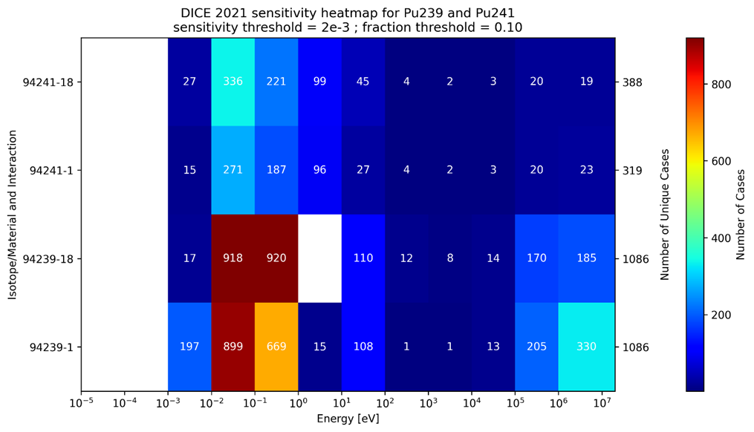



# CALINS

### **CAL**culations and **I**nvestigations on **N**uclear data uncertainties and **S**ensitivities

[](https://www.python.org/downloads/)
[](LICENSE)

> A Python package for computing nuclear data uncertainty propagation, sensitivity analyses, and data assimilation using the Generalized Linear Least Squares Method (GLLSM).

**📚 [Read the Documentation](https://asnr-fr.github.io/CALINS/)** | **🚀 [Quick Start Guide](https://asnr-fr.github.io/CALINS/installation/)** | **💡 [Usage Examples](https://asnr-fr.github.io/CALINS/usage-examples/creating-case-object/)**

**Developed by**: French Authority for Nuclear Safety and Radiation Protection (ASNR)

---

## Table of Contents

- [**About**](#about)
- [**Features**](#features)
- [**Quick Start**](#quick-start)
- [**Installation**](#installation)
  - [Prerequisites](#prerequisites)
  - [Installing CALINS](#installing-calins)
  - [Verification](#verification)
- [**Usage Examples**](#usage-examples)
  - [Creating a Case Object](#creating-a-case-object)
  - [Calculating Uncertainty](#calculating-uncertainty)
  - [Computing Similarity Indices](#computing-similarity-indices)
  - [Performing Data Assimilation](#performing-data-assimilation)
  - [Sensitivity Analysis and Case Screening](#sensitivity-analysis-and-case-screening)
- [**Points of Attention**](#points-of-attention)
- [**Theory**](#theory)
  - [Introduction](#introduction)
  - [Sensitivity Vector](#sensitivity-vector)
  - [Covariance Matrix](#covariance-matrix)
  - [Alignment Rule for Matrix Calculations](#alignment-rule-for-matrix-calculations)
  - [Uncertainty Calculation on the Response: σrespND](#uncertainty-calculation-on-the-response-σrespnd)
  - [Assimilation of Experimental Data and Bias Calculation via GLLSM](#assimilation-of-experimental-data-and-bias-calculation-via-gllsm)
    - [Pre-sorting of Benchmark Cases to Assimilate](#pre-sorting-of-benchmark-cases-to-assimilate)
    - [Assimilation Formulas](#assimilation-formulas)
  - [Reflections on Experimental Correlations](#reflections-on-experimental-correlations)
- [**Developer Manual**](#developer-manual)
  - [methods.py](#methodspy)
    - [Acquisition and Formatting of Useful Data (Pandas Dataframe)](#acquisition-and-formatting-of-useful-data-pandas-dataframe)
    - [Construction of Matrices and Vectors (Numpy Arrays)](#construction-of-matrices-and-vectors-numpy-arrays)
    - [Calculation Functions](#calculation-functions)
    - [Utility Functions](#utility-functions)
  - [classes.py](#classespy)
    - [Case](#case)
    - [Uncertainty](#uncertainty)
    - [Bias](#bias)
    - [Assimilation](#assimilation)
  - [plots.py](#plotspy)
  - [errors.py](#errorspy)
  - [logs.py](#logspy)
- [**Contributing**](#contributing)
- [**Troubleshooting**](#troubleshooting)
- [**Citation**](#citation)
- [**References**](#references)
- [**License**](#license)

---

## About

CALINS is a specialized Python package designed for nuclear safety and criticality calculations. It enables:
- **Uncertainty propagation** from nuclear data to integral responses
- **Sensitivity analysis** of nuclear systems to cross-section variations
- **Data assimilation** using the Generalized Linear Least Squares Method (GLLSM)
- **Bias estimation** for calculated responses based on experimental benchmarks

The package is particularly useful for criticality safety analyses where understanding uncertainties and biases in calculated k<sub>eff</sub> values is essential.

## Features

- ✅ **Uncertainty Calculation**: Propagate nuclear data uncertainties using the sandwich formula
- ✅ **Sensitivity Analysis**: Process and visualize sensitivity profiles from SDF files
- ✅ **Similarity Indices**: Calculate E, C<sub>k</sub>, G, and SSR indices between cases
- ✅ **GLLSM Assimilation**: Assimilate experimental benchmark data to reduce uncertainties
- ✅ **Multiple Covariance Formats**: Support for SCALE (COVERX binary/text), COMAC, GENDF, and Excel (xlsx) formats, with auto-detection
- ✅ **Interactive Visualizations**: Generate HTML reports with Plotly graphs
- ✅ **Chi-squared Filtering**: Automatic filtering of inconsistent benchmark cases

# Installation

## Prerequisites

- **Python**: Version 3.9 or higher
- **Operating System**: Windows, macOS, or Linux
- **Dependencies**: Listed in `requirements.txt` (automatically installed)
  - numpy ≥ 1.24.2
  - pandas ≥ 2.0.0
  - plotly ≥ 5.14.0
  - matplotlib ≥ 3.8.3
  - tabulate ≥ 0.9.0
  - scipy ≥ 1.13.0

## Installing CALINS

### Method 1: From GitHub (Latest Version)

1. **Clone or download the repository**:
   ```bash
   git clone https://github.com/ASNR-fr/CALINS.git
   cd CALINS
   ```

2. **Install the package**:
   ```bash
   pip install .
   ```

### Method 2: From ZIP Archive

If you have downloaded a compressed archive:

```bash
pip install calins-archive.zip
```

### Method 3: Development Installation

For development or contributing, install in editable mode:

```bash
pip install -e .
```

## Verification

Verify that CALINS is installed correctly:

```python
import calins as cl
print(cl.__name__)  # Should print: calins
```

You can also check for auto-completion in your Python IDE/environment to confirm the installation.

# Usage Examples

This section provides practical examples for common CALINS operations. For comprehensive examples, refer to the `USER_EXAMPLES.ipynb` notebook.

## Creating a Case Object

A `Case` object represents an application case or benchmark with sensitivity data:

```python
import calins as cl

# Path to your sensitivity file (.sdf format)
sensi_file_path = 'path/to/sensitivity.sdf'

# Create Case object
# occurrences_rule: how to handle multiple occurrences of same iso-reac pair
#   Options: "first", "last", "sum" (default)
my_case = cl.Case(sdf_path=sensi_file_path, occurrences_rule="sum")

# Generate HTML visualization of sensitivities
my_case.export_to_html(
    output_html_path='case_sensitivities.html',
    plotting_unit='pcm'  # Options: 'pcm' or 'relative'
)

# Access case attributes
print(f"Case name: {my_case.casename}")
print(f"Energy groups: {my_case.group_nb}")
print(f"Calculated k_eff: {my_case.resp_calc} ± {my_case.sigma_resp_calc}")
if my_case.resp_expe:
    print(f"Experimental k_eff: {my_case.resp_expe} ± {my_case.sigma_resp_expe}")
```

## Calculating Uncertainty

Calculate nuclear data uncertainty using the sandwich formula:

```python
import calins as cl

# Load covariance data using NDCovariances object (recommended)
scale_file_path = 'path/to/scale_44g'
cov_data = cl.NDCovariances(input_path=scale_file_path, format='coverx')
# Alternative formats: 'coverx_text', 'comac', 'gendf', 'xlsx', or 'auto' for auto-detection

# Load sensitivity data
sensi_file_path = 'path/to/sensitivity.sdf'

# Calculate a priori uncertainty
uncertainty = cl.calcul_uncertainty(
    appl_case=sensi_file_path,  # Can also be a Case object
    cov_data=cov_data,
    reac_list=[2, 4, 16, 18, 102, 103, 452, 1018],
    output_html_path='uncertainty_report.html'
)

print(f"A priori uncertainty: {uncertainty.value} pcm")
print(f"Calculated k_eff: {uncertainty.resp_calc}")

# Export decomposition to Excel
uncertainty.decomposition.to_excel('uncertainty_decomposition.xlsx')

# Optional: Export and re-import covariance data via Excel
# cov_data.write_xlsx('covariance_data.xlsx')
# cov_data_reloaded = cl.NDCovariances(input_path='covariance_data.xlsx', format='xlsx')
```

## Computing Similarity Indices

Evaluate similarity between different cases:

```python
import calins as cl

# Load two cases to compare
case1 = cl.Case('path/to/case1.sdf')
case2 = cl.Case('path/to/case2.sdf')

# Load covariance data using NDCovariances object (recommended)
cov_data = cl.NDCovariances(input_path='path/to/covariance', format='auto')

# Calculate E similarity index (0 to 1)
E_index = cl.calcul_E(case1, case2, reac_list=[2, 4, 16, 18, 102, 103, 452, 1018])
print(f"E similarity index: {E_index}")

# Calculate C_k index (weighted by covariances)
Ck_index = cl.calcul_Ck(case1, case2, cov_data, reac_list=[2, 4, 16, 18, 102, 103, 452, 1018])
print(f"C_k similarity index: {Ck_index}")

# Calculate SSR index (Shared Sensitivity Ratio)
SSR_index = cl.calcul_SSR(appl_case=case1, bench_case=case2, reference=case1, reac_list=[2, 4, 16, 18, 102, 103, 452, 1018])
print(f"SSR index: {SSR_index}")
```

## Performing Data Assimilation

Assimilate experimental benchmark data using GLLSM:

```python
import calins as cl

# Define application case
appl_case = cl.Case('path/to/appl_case.sdf')

# Define benchmark cases
benchmarks = [
    cl.Case('path/to/benchmark1.sdf'),
    cl.Case('path/to/benchmark2.sdf'),
    cl.Case('path/to/benchmark3.sdf')
]

# Load covariance data using NDCovariances object (recommended)
cov_data = cl.NDCovariances(input_path='path/to/covariance', format='auto')

# Perform assimilation
assimilation = cl.Assimilation(
    appl_case=appl_case,
    benchmarks_list=benchmarks,
    cov_data=cov_data,
    chi2_threshold=1.5,  # Optional: chi-squared filtering threshold
    Ck_threshold=0.7,    # Optional: C_k similarity threshold
    reac_list=[2, 4, 16, 18, 102, 103, 452, 1018],
    output_html_path='assimilation_results.html'
)

# Access results
print(f"Prior uncertainty: {assimilation.prior_uncertainty.value} pcm")
print(f"Posterior uncertainty: {assimilation.post_uncertainty.value} pcm")
print(f"Bias: {assimilation.bias.value} pcm")
print(f"Chi-squared: {assimilation.chi2_initial} → {assimilation.chi2_final}")
```

## Sensitivity Analysis and Case Screening

CALINS provides advanced capabilities for sensitivity analysis and case screening, allowing users to identify the most sensitive cases and analyze sensitivity patterns across multiple benchmarks.

These functions are particularly useful for:
- **Benchmark selection**: Identifying the most sensitives cases, targetting specific nuclear data
- **Pattern identification**: Spotting systematic sensitivity trends across benchmark suites and uderstanding which energy ranges drive uncertainties
- **Isotope comparison**: Comparing sensitivity patterns between different isotopes
- **Benchmark characterization**: Understanding the physical characteristics of different experiments
- **Cross-section priority**: Determining which nuclear data require the most attention

### Finding Sensitive Cases

Use `find_sensitive_cases()` to identify cases with significant sensitivities to specific isotope-reaction pairs:

```python
import calins as cl
import pickle

# Path to a pickle containing a dictionary of Case objects
pickle_db = "/PATH/TO/DATABASE/cases.pickle" 

with open(pickle_db, "rb") as pickle_file:
    dict_pickle = pickle.load(pickle_file)

# Selecting cases to consider for analysis - here all MIX-COMP-THERM except series 006
filtered_cases = cl.filter_cases(dict_pickle, to_keep=["MIX-COMP-THERM"], to_exclude=["MIX-COMP-THERM-006"]) 

# Searching for cases sensitive to the fission cross-sections of U-235 and Pu-239 in the thermal domain,
# based on integral sensitivities, not normalized in lethargy.
# Only bins with a sensitivity ≥ 2e-3, representing more than 10% of the integral sensitivity, are considered sensitive.
sensitive_cases = cl.find_sensitive_cases(
    dict_pickle,
    filtered_cases,
    isotopes=[92235, 94239],
    reactions=[18, 18],
    energy_regions=["thermal", "thermal"],
    sensitivity_threshold=2e-3,
    fraction_threshold = 0.10,
    integrate_data=True,
    normalize_lethargy = False,
)

# Displaying in the terminal the 50 most sensitive cases according to the previous search criteria
cl.display_most_sensitive_cases(dict_sensitive = sensitive_cases, max_number_of_cases_displayed=50)
```

### Creating Sensitivity Heatmaps

Use `plot_sensitivity_heatmap()` to create visual heatmaps showing how many cases show the same sensitivity patterns across multiple energy regions:



```python
import calins as cl
import pickle

# Path to a pickle containing a dictionary of Case objects
pickle_path = "/PATH/TO/DATABASE/database_dict.pickle"

with open(pickle_path, "rb") as pickle_file:
    dict_pickle = pickle.load(pickle_file)

# Selecting cases to consider for analysis - here all LEU-COMP-THERM except series 001
list_cases = cl.filter_cases(dict_pickle, to_keep=[], to_exclude=[]) 

# Creating a heatmap of cases sensitive to cross-sections of SCATTER (0), TOTAL (1), ELASTIC (2), N,GAMMA (102)
# Only bins with a sensitivity ≥ 2e-3 and representing more than 10% of the integral sensitivity will be considered sensitive.
cl.plot_sensitivity_heatmap(
    dict_data=dict_pickle,
    cases=list_cases,
    isotopes=[17035, 17037],
    reactions=[0, 1, 2, 102],
    sensitivity_threshold=2e-3,
    fraction_threshold = 0.10,
    user_energy_bins=None,
    title="Cases pickle db sensitivity heatmap for chlorine isotopes",
    namefig=None,
    save_logfile=True,
)
```

## Points of Attention

⚠️ **Important Considerations** (read this section along with the [Theory](#theory) chapter and examples in `USER_EXAMPLES.ipynb`)

### Special Isotope Handling

- **Bounded isotopes**: Some isotopes in sensitivity files are not present in variance-covariance matrices. TSURFER (SCALE) uses data from the closest isotope, and CALINS detects these cases when the hundreds digit of the ID is ≥ 3:
  - `be-9 bounded` (ID=4309 or 4509) → associated with covariances of `be-9` (ID=4009)
  - `h-1 bounded` (ID=1901 or 1801) → associated with covariances of `h-1` (ID=1001)

- **Natural isotopes**: Isotopes with 'natural' evaluated forms:
  - `c-12 bounded` (ID=6312) → associated with covariances of `c-0` (ID=6000)

### Reaction ID Considerations

- **CAPTURE vs N,GAMMA**: Some covariance matrices have data for CAPTURE reaction (ID=101), others for N,GAMMA reaction (ID=102), which are very close. Be careful when associating these reactions.

- **MCNP negative IDs**: SDF files from MCNP calculations can contain reactions with negative IDs:
  - CALINS associates reaction `-2` to reaction `101` if the `mcnp=True` flag is enabled when creating the Case object
  - Other negative reactions trigger a warning

### Sensitivity Profile Occurrences

When an SDF file has multiple sensitivity profiles for the same isotope-reaction pair (same IDs), TSURFER (SCALE) parses profiles differently. CALINS provides three rules:
- `occurrences_rule='first'`: Use the first occurrence as the sensitivity profile
- `occurrences_rule='sum'` (default): Sum all occurrences for the profile
- `occurrences_rule='last'`: Use the last occurrence


# Theory & Developer Manual

For complete theoretical background and developer documentation, see the online documentation:

- **[Theory](https://asnr-fr.github.io/CALINS/theory/introduction/)** — Sensitivity vectors, covariance matrices, sandwich formula, GLLSM assimilation, similarity indices
- **[Developer Manual](https://asnr-fr.github.io/CALINS/developer-manual/methods/)** — Code architecture, data structures, classes, and internal functions

# Contributing

Contributions to CALINS are welcome! If you would like to contribute:

1. **Fork the repository** on GitHub
2. **Create a new branch** for your feature or bug fix
3. **Make your changes** with clear, descriptive commit messages
4. **Add tests** if applicable
5. **Ensure all tests pass** by running `pytest ./tests/test_unitaires.py`
6. **Submit a pull request** with a clear description of your changes

For major changes, please open an issue first to discuss what you would like to change.

## Development Setup

For development, install in editable mode:

```bash
git clone https://github.com/ASNR-fr/CALINS.git
cd CALINS
pip install -e .
pip install pytest  # For running tests
```

# Troubleshooting

## Common Issues

### Import Errors

**Problem**: `ModuleNotFoundError: No module named 'calins'`

**Solution**: Ensure CALINS is properly installed:
```bash
pip install .
# Or for development:
pip install -e .
```

### Missing Dependencies

**Problem**: Import errors for numpy, pandas, plotly, etc.

**Solution**: Install all dependencies:
```bash
pip install -r requirements.txt
```

### Sensitivity File Parsing Issues

**Problem**: Error when loading SDF files

**Solutions**:
- Ensure the file path is correct and the file exists
- Check that the SDF file format is compatible (SCALE/TSUNAMI format)
- Try using `mcnp=True` flag for MCNP-generated files with negative reaction IDs
- Verify the `occurrences_rule` parameter if you have duplicate iso-reac pairs

### Covariance Matrix Issues

**Problem**: Missing covariance data for specific isotopes

**Solution**: CALINS automatically handles some cases:
- Bounded isotopes (e.g., h-poly) use data from base isotopes
- Natural isotopes (e.g., c-0) are matched to specific isotopes when available
- Check the warnings in logs for missing data

### Matrix Inversion Errors

**Problem**: Cholesky decomposition fails during assimilation

**Solutions**:
- Reduce the number of benchmark cases
- Check for highly correlated benchmarks
- Verify that experimental uncertainties are realistic
- Consider using chi-squared or C<sub>k</sub> filtering

## Getting Help

If you encounter issues not covered here:
- Check the logs in `~/.CALINS/` for detailed error messages
- Review the `USER_EXAMPLES.ipynb` notebook for working examples
- Open an issue on GitHub with:
  - Description of the problem
  - Minimal code to reproduce the issue
  - Error messages and logs
  - CALINS version and Python version

# Citation

If you use CALINS in your research or work, please cite it appropriately:

```bibtex
@inproceedings{barthelemi:hal-05111043,
  TITLE = {{CALINS: A New ASNR Software for Sensitivity and Uncertainty Analysis in Nuclear Criticality Safety Evaluations}},
  AUTHOR = {Barth{\'e}l{\'e}mi, Petillon and Arthur, Peron and Vuiart, Romain and Jaiswal, Vaibhav and Brovchenko, Mariya},
  URL = {https://asnr.hal.science/hal-05111043},
  BOOKTITLE = {{NCSD 2025 - Nuclear Criticality Safety Division 2025 Conference}},
  ADDRESS = {Austin (TX), United States},
  ORGANIZATION = {{American Nuclear Society (ANS)}},
  YEAR = {2025},
  MONTH = Sep,
  KEYWORDS = {criticality ; nuclear data ; nuclear safety ; CALINS ; TSURFER ; software ; GLLSM ; propagation ; uncertainty ; sensitivity},
  PDF = {https://asnr.hal.science/hal-05111043v1/file/2025_NCSD_V%26V-CALINS.pdf},
  HAL_ID = {hal-05111043},
  HAL_VERSION = {v1},
}
```

# References

## Key Publications

[^2]: SCALE 6.3.1 User Manual - TSURFER: [https://scale-manual.ornl.gov/tsurfer.html](https://scale-manual.ornl.gov/tsurfer.html)

[^3]: T. Nicol, C. Carmouze. Impact of experimental correlation on transposition method carry out with critical integral experiments. ICNC 2019 - 11th International conference on Nuclear Criticality Safety, Sep 2019, Paris, France. ffcea-02614125

## Related Resources

- **SCALE Code System**: [SCALE Documentation](https://www.ornl.gov/scale)
- **ICSBEP Handbook**: [International Handbook of Evaluated Criticality Safety Benchmark Experiments](https://www.oecd-nea.org/science/wpncs/icsbep/)
- **ENDF Database**: [Evaluated Nuclear Data File](https://www.nndc.bnl.gov/endf/)

# License

This project is licensed under the BSD-3-Clause License - see the LICENSE file for details.

---

**Developed and maintained by**: French Authority for Nuclear Safety and Radiation Protection (ASNR)

**Contact**: For questions and support, please use the GitHub issue tracker.

**Version**: 1.0.0-beta
