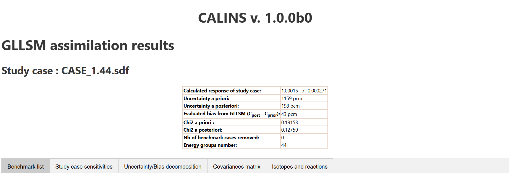
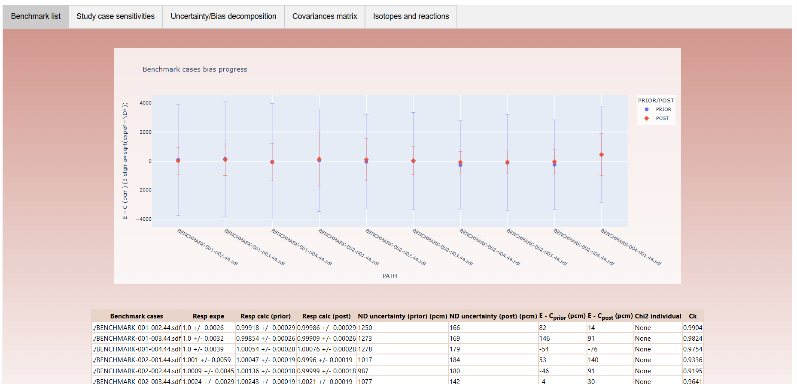
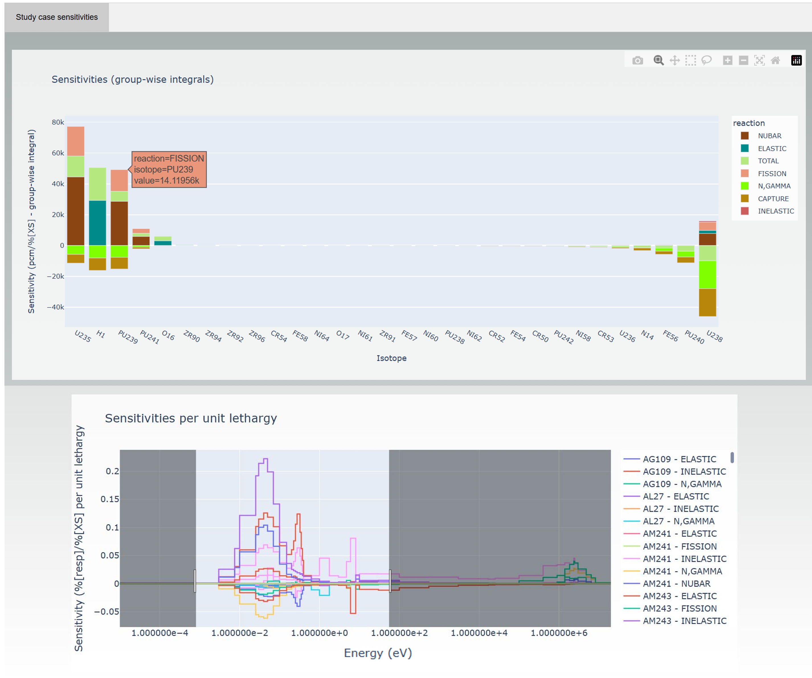
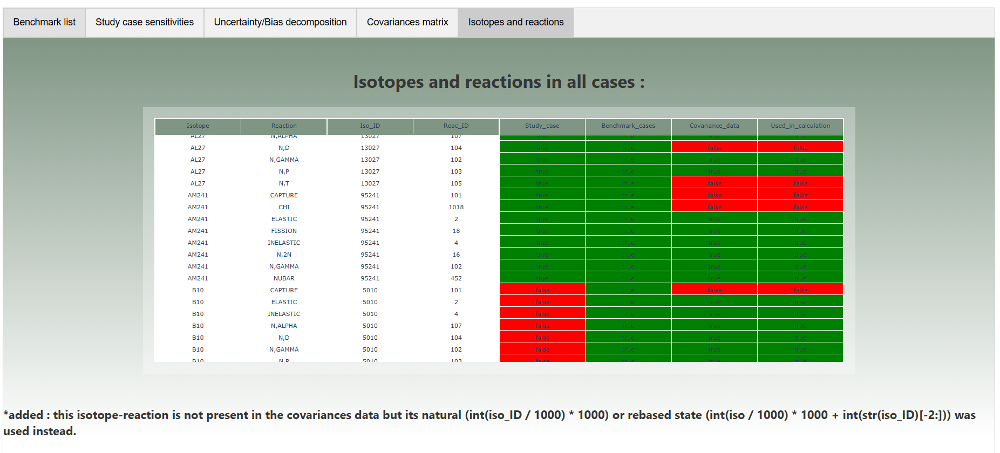
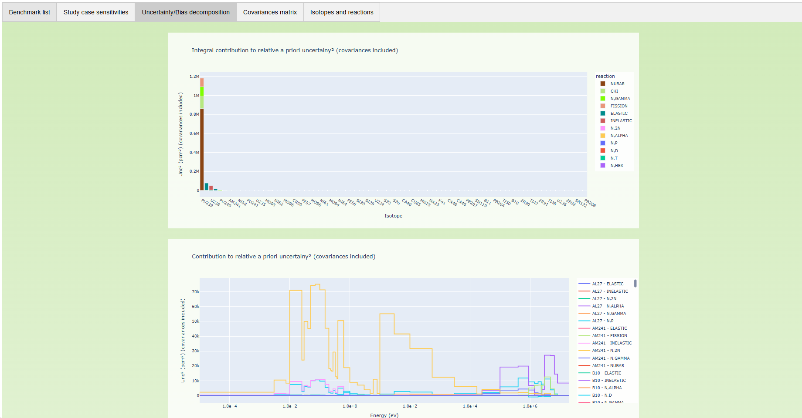

# CALINS

### **CAL**culations and **I**nvestigations on **N**uclear data uncertainties and **S**ensitivities

> A Python package for computing nuclear data uncertainty propagation, sensitivity analyses, and data assimilation using the Generalized Linear Least Squares Method (GLLSM).

**Developed by**: French Authority for Nuclear Safety and Radiation Protection (ASNR)

---

## About

CALINS is a specialized Python package designed for nuclear safety and criticality calculations. It enables:
- **Uncertainty propagation** from nuclear data to integral responses
- **Sensitivity analysis** of nuclear systems to cross-section variations
- **Data assimilation** using the Generalized Linear Least Squares Method (GLLSM)
- **Bias estimation** for calculated responses based on experimental benchmarks

The package is particularly useful for criticality safety analyses where understanding uncertainties and biases in calculated keff values is essential.

## Features

- ✅ **Uncertainty Calculation**: Propagate nuclear data uncertainties using the sandwich formula
- ✅ **Sensitivity Analysis**: Process and visualize sensitivity profiles from SDF files
- ✅ **Similarity Indices**: Calculate E, Ck, G, and SSR indices between cases
- ✅ **GLLSM Assimilation**: Assimilate experimental benchmark data to reduce uncertainties
- ✅ **Multiple Covariance Formats**: Support for SCALE (COVERX binary/text), COMAC, GENDF, and Excel (xlsx) formats, with auto-detection
- ✅ **Interactive Visualizations**: Generate HTML reports with Plotly graphs
- ✅ **Chi-squared Filtering**: Automatic filtering of inconsistent benchmark cases

