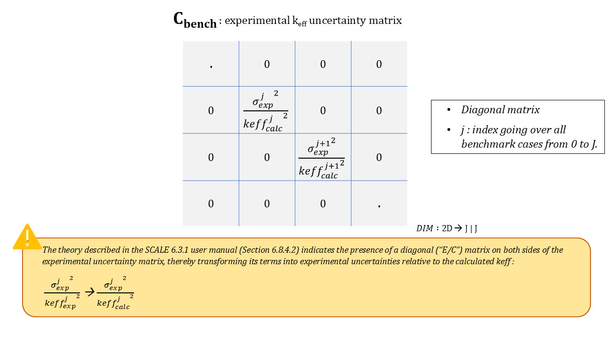
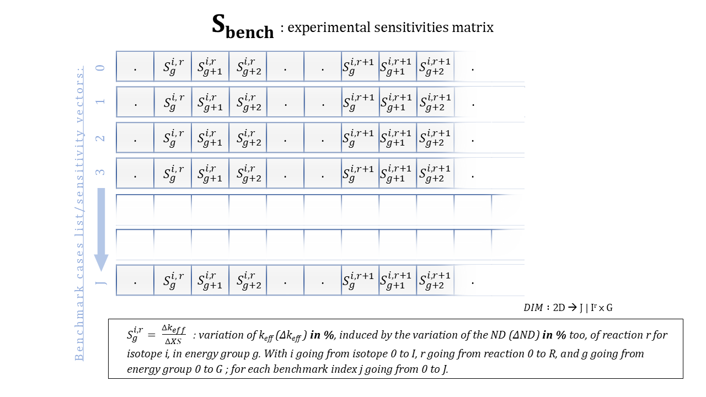

# Assimilation of Experimental Data and Bias Calculation via GLLSM

The GLLSM method consists in assimilating experiences (also called "benchmark" cases) whose response has been measured and calculated.

---
*The GLLS approach considers potential variations in data parameters and measured integral responses that minimize the differences in measured and calculated integral responses (such as keff) for a set of benchmark experiments, taking into account uncertainties and correlations in the ENDF data and in the integral measurements. Since there are generally many more cross-section values than measured integral responses, the determination of the data modifications is an under-determined problem. If the data variations are not performed in a reasonable manner, non-physical changes may be obtained. Data adjustments in the GLLS methodology are constrained by the magnitude of the nuclear data uncertainties and their correlations. TSURFER also accounts for uncertainties and correlations in the integral response measurements, arising from experimental uncertainties in parameters such as enrichment, density, impurities, etc. As long as realistic data covariances are used, the resulting data adjustments may be considered the "best estimates"-within the limitations of the GLLS linearity approximation-for realistic data alterations that improve the computed integral responses. It can be shown that the GLLS equations provide the maximum likelihood estimator for the correct nuclear data if the evaluated nuclear data and system parameters obey a multivariate normal probability distribution* [^1].
[^1]: R. N. Hwang. Topics in data adjustment theory and applications. In Proceedings of the Specialists' Meeting on the Application of Critical Experiments and Operating Data to Core Design via Formal Methods of Cross Section Data Adjustment. Jackson Hole, WY (USA), 9 1988.

---

This assimilation method yields:
1. **Global nuclear data variation vector** ($\Delta\mu_{ND}$): Derived from assimilated benchmarks, enabling posterior bias prediction Δresppost for an application case whose response is not known experimentally (vector $S_{\text{appl}}$)
2. **Adjusted covariance matrix** ($Cov'$): Enabling posterior uncertainty calculation σrespND post for an application case ($S_{\text{appl}}$) using the sandwich formula

The validity domain of this method is defined by several hypotheses:
- The total calculation bias is mostly composed of ΔrespND (verified especially for pointwise Monte Carlo calculations)
- The response variation caused by small variations in nuclear data is reasonably linear
- The application case is similar in sensitivity to the assimilated benchmarks (similarity is discussed below)

## Pre-sorting of benchmark cases to assimilate

The impact of benchmarks on posterior uncertainty σrespND post depends on similarity to the application case (fissile material, moderator, spectrum).
It is possible to pre-sort experiments to assimilate based on these physical criteria. For example, ICSBEP classifications already help pre-select benchmark cases similar to your application case.

Similarity indicators (E, Ck, G, SSR, etc.) can also be computed between sensitivity vectors. They help pre-sort benchmarks, which, once assimilated, will best impact the posterior uncertainty of the application case.

These indicators should be calculated for each benchmark to add to the assimilation list.

**Similarity index $E$ (value between 0 and 1):**
This index is a normalized dot product between a benchmark and the case.

$$ E = \frac{S_1 \cdot S_2^t}{||S_1|| \cdot ||S_2||} $$

**Similarity index $C_k$ (value between 0 and 1):**
This index weights the dot product with covariance values.

$$ C_k = \sqrt{\frac{(S_1 \cdot Cov \cdot S_2^t)^2}{(S_1 \cdot Cov \cdot S_1^t)(S_2 \cdot Cov \cdot S_2^t)}} $$

**Overlap index G (value between 0 and 1):**
This index calculates the overlap rate of each sensitivity corresponding to an energy group, isotope, and reaction. The rate is calculated by taking a case as reference, and another to compare to.

$$  G = 1 - {\sum_{g}^{}\sum_{i, r}^{} \left\{\begin{cases}
S_{ref}^{g, i, r} - S_{comp}^{g, i, r} & \text{if } S_{ref}^{g, i, r} \times S_{comp}^{g, i, r} > 0 \text{ and } |S_{ref}^{g, i, r}| \geq |S_{comp}^{g, i, r}| \\
S_{ref}^{g, i, r} & \text{else}
\end{cases}\right. \over 
\sum_{g}^{}\sum_{i, r}^{} S_{ref}^{g, i, r}  }$$

${S_{ref}}$: reference sensitivity vector  ${S_{comp}}$: comparison sensitivity vector

**Shared Sensitivity Ratio SSR (formula by Mariya BROVCHENKO)**
This index calculates the overlap rate of each sensitivity corresponding to an energy group, isotope, and reaction. The rate is calculated by taking a case as reference, and another to compare to.

$$ SSR =  {\sum_{g}^{}\sum_{i, r \space in \space ref}^{} \left\{\begin{cases}
\min(|S_{ref}^{g, i, r}|, |S_{comp}^{g, i, r}|) & \text{if } S_{ref}^{g, i, r} \times S_{comp}^{g, i, r} > 0 \\
\text{else} & 0 
\end{cases}\right. \over 
\sum_{g}^{}\sum_{i, r}^{} | S_{ref}^{g, i, r} | }$$

${S_{ref}}$: reference sensitivity vector  ${S_{comp}}$: comparison sensitivity vector

**Sorting by the value of $\chi ^2$**

*To be written: see Chapter 6.8.4.2.1 of the SCALE 6.3.1 User Manual [^2]*
[^2]: https://scale-manual.ornl.gov/tsurfer.html#consistency-relations-and-chi-square-filtering

## Assimilation formulas

**Description of data used for GLLSM**:
- a "C-E benchmarks vector" $\Delta k_{C-E \text{ bench}}$ containing the relative response differences ((C-E)/C) of selected benchmarks;

- uncertainties σrespexp, to build the "experimental uncertainty matrix" $C_{bench}$. This matrix can include experimental correlations...

- the "benchmark sensitivity matrix" $S_{\text{bench}} = ..|S_{\text{bench}}^j | S_{\text{bench}}^{j+1} | ..$ built from the sensitivity vectors $S_{\text{bench}}^j$ (j: benchmark index)

⚠️Note that the $Cov$ matrix depends on the benchmarks used. It is defined by the union of isotope-reaction pairs present in the benchmarks and the application case.

***

**Global nuclear data variation vector (from assimilated benchmarks) $\Delta\mu_{ND}$:**

$$ \Delta\mu_{ND} = Cov \cdot S_{\text{bench}}^t \cdot  (C_{\text{bench}}+S_{\text{bench}} \cdot Cov \cdot S_{\text{bench}}^t)^{-1} \cdot (- \Delta k_{C/E \text{ bench}}) $$

**Application case to experiments weighting vector:** dimmesion: J = number of experiments

$$ \lambda_{J} =  S_{\text{appl}} \cdot Cov \cdot S_{\text{bench}}^t \cdot  (C_{\text{bench}}+S_{\text{bench}} \cdot Cov \cdot S_{\text{bench}}^t)^{-1} $$

**Adjusted covariance matrix $Cov'$:**

$$ Cov' = Cov - \Delta Cov_{assim} $$

$$ Cov' = Cov - Cov \cdot S_{\text{bench}}^t \cdot  (C_{\text{bench}}+S_{\text{bench}} \cdot Cov \cdot S_{\text{bench}}^t)^{-1} \cdot  S_{\text{bench}} \cdot Cov $$

The required inversion is not always mathematically possible. The impact of inversion methods leading to "pseudo-inverse" terms has not yet been investigated. To verify invertibility, the Cholesky matrix inversion algorithm (implemented in CALINS) either provides a valid result or halts execution.

***

**A posteriori bias Δresppost**, deviation $(k_{eff}^{expe}-k_{eff}^{calc}) \over k_{eff}^{calc}$ (unit: %, value relative to the calculated response):

$$ \Delta \text{resp}^{\text{post}} = S_{\text{appl}} \cdot \Delta\mu_{ND} $$
$$ \Delta \text{resp}^{\text{post}} = \lambda_{B} \cdot (- \Delta k_{C/E \text{ bench}}) $$

**Application bias population standard deviation**

$$ \sigma_{\text{bias}}^{\text{pop, appl}} = \sqrt{ \sum_{j}^{}\lambda_{j}^2 \cdot ({\sigma_{\text{resp}}^{\text{expe, j}}}^2 + {\sigma_{\text{resp}}^{\text{ND prior, j}}}^2)} $$

**A priori uncertainty** (unit: %, value relative to the calculated response):

$$ \sigma_{\text{resp}}^{\text{ND prior, appl}} = \sqrt{S_{\text{appl}} \cdot Cov \cdot S_{\text{appl}}^t} $$

**A posteriori uncertainty** (unit: %, value relative to the calculated response):

$$ \sigma_{\text{resp}}^{\text{ND post, appl}} = \sqrt{S_{\text{appl}} \cdot Cov' \cdot S_{\text{appl}}^t} $$

***